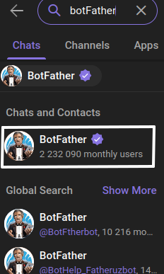
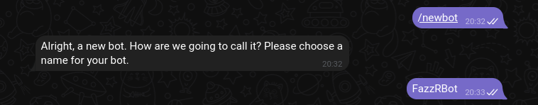
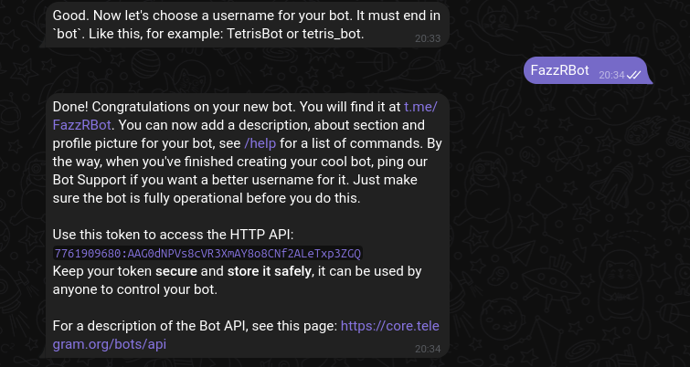

# This is a telegram bot project
    Description

    Project ini Dibuat dengan tujuan untuk memudahkan seseorang
    seperti mendownload video, audio, image atau file dari berbagai platform tertentu.

    Jika anda menggunakan/mengcopy repo ini maka itu akan menjadi tanggung jawabmu sendiri,
    dan resiko pun harus ditanggung sendiri apapun yang terjadi


project ini bisa dijalankan di device mana saja

disaat project ini di luncurkan, project ini dapat dijalankan di sistem operasi:
- Android
- Linux
- Windows

## Prepareation

ada beberapa hal yang perlu di persiapkan, diantaranya yaitu:

- nodejs, dan
- Kode editor (ex: vscode, acode (android),  jetBrains, etc)


> Sebelum masuk ke instalasi, kamu harus menyiapkan botnya terlebih dahulu

## Dipencarian ketik "BotFather" dan klik  di bagian "Chat and Contacts




## ketik /newbot untuk membuat bot baru
Masukkan nama bot sesuai yang diinginkan


## Setelah itu masukkan username bot

#### Penting: buatlah username botmu yang mudah diingat, agar orang bisa dengan mudah mencarinya, username yang kamu masukkan terkadang tidak bisa karena sudah di gunakan duluan oleh orang lain



## Installation
> setelah persiapan selesai, dilanjutkan dengan menginstall nodejs dan git, lalu mengcopy repo dan menjalankannya, silahkan dilihat tata caranya sesuai dengan sistem operasi yang sedang dipakai

### Android (Termux)

kamu bisa mendownload termux di playstore ataupun di github termuxnya, kamu bisa mendownload termux dengan mengikuti link ini:
* Termux [github](https://github.com/termux/termux-app/releases)
* Termux [Playstore](https://play.google.com/store/apps/details?id=com.termux&pcampaignid=web_share)
* Termux [Fdroid](https://f-droid.org/packages/com.termux/)


``` bash
pkg update -y && pkg upgrade -y

termux-setup-storage

pkg install nodejs -y && pkg install git -y

git clone https://github.com/FazzRqy/ZRellBot

cd ZRellBot

npm install && npm start
```

### Linux
#### note: setiap os linux mempunyai cara pemasangan/penginstallan package yang berbeda-beda seperti kali/debian linux yang menggunakan apt-get/apt, centOS/redhead yang menggunakan yum, walaupun begitu, tetapi cara penginstallannya hampir sama

#### untuk tutorial ini, kita akan menggunakan turunan debian

```bash
sudo apt update -y && apt upgrade -y

sudo apt install nodejs && apt install git

git clone https://github.com/FazzRqy/ZRellBot

cd ZRellBot

npm install && npm start
```
### Jika waktu penginstallan package botnya error, coba tambahkan sudo

``` bash
sudo npm install && npm start
```
#### Note:  Jika terjadi error/bug silahkan bertanya [disini](https://github.com/FazzRqy/ZRellBot/issues/new?template=Blank+issue/)
